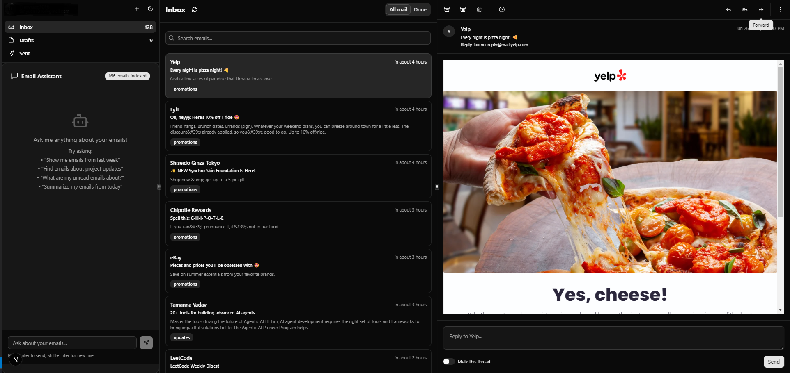
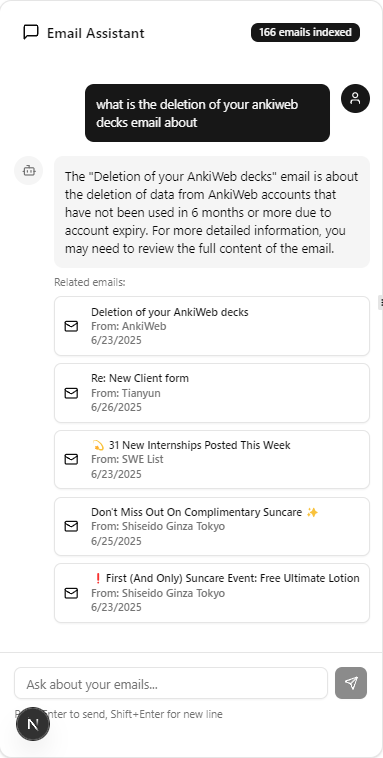

# MailMind

## Overview

MailMind is an AI-powered email client that combines intelligent email organization with a conversational assistant. It lets you triage faster, ask natural-language questions over your mailbox (RAG), and draft/send emails with AI assistance.

## UI Demo

### Light Mode


### Dark Mode



### Chatbot



## 🌟 Features

- **Smart email management**: Inbox, threads, search, and compose/reply flows
- **AI-powered chat (RAG)**: Ask questions and get citation-backed answers
- **Real-time sync**: Incremental sync via Aurinko; background workers keep data fresh
- **Modern UI**: Next.js App Router, shadcn/Radix UI, Tailwind CSS, streaming chat

## 🏗️ Tech Stack

### Frontend

- **Framework**: Next.js 15 with TypeScript (App Router)
- **UI**: shadcn/ui + Radix UI primitives
- **Styling**: Tailwind CSS
- **Data fetching**: SWR
- **Deployment**: Vercel

### Backend

- **Framework**: FastAPI (Python)
- **Database**: PostgreSQL (e.g., Neon)
- **ORM**: SQLAlchemy 2.0 + Alembic
- **Auth**: Cookie-based auth (JWT token in cookie), CORS configured for Vercel
- **Workers/Queue**: ARQ + Redis for background sync/indexing
- **AI/RAG**: LangChain/LangGraph + Chroma vector store
- **Email Integration**: Aurinko API
- **Deployment**: Cloud Run

### Tooling

- **Package manager**: npm (frontend), pip (backend)
- **Code quality**: ESLint, TypeScript

## 🚀 Getting Started

### Prerequisites

- **Node.js** 18+
- **Python** 3.10+
- **PostgreSQL** database (or Neon account)
- **Redis** (for ARQ workers)
- **Aurinko API** credentials
- **OpenAI API** key (optional, for AI features)

### Backend Setup

1. Navigate to backend and create venv

   ```bash
   cd backend
   python -m venv venv
   # Windows
   venv\Scripts\activate
   # macOS/Linux
   # source venv/bin/activate
   ```

2. Install dependencies

   ```bash
   pip install -r requirement.txt
   ```

3. Environment configuration
   
   Create a new `.env` file based on the `.env.example` file.

4. Migrations and init

   ```bash
   alembic upgrade head
   # optional
   # python -m app.init_db
   ```

5. Start API (dev)

   ```bash
   uvicorn app.main:app --reload --host 0.0.0.0 --port 8000
   ```

### Frontend Setup

1. Navigate to frontend

   ```bash
   cd frontend
   ```

2. Install dependencies

   ```bash
   npm install
   ```

3. Environment configuration

   ```env
   NEXT_PUBLIC_API_BASE_URL=http://localhost:8000
   NEXT_PUBLIC_AURINKO_CLIENT_ID=your_aurinko_client_id
   ```

4. Start dev server

   ```bash
   npm run dev
   ```

The application will be available at:

- **Frontend**: http://localhost:3000
- **Backend API**: http://localhost:8000
- **API docs**: http://localhost:8000/docs

## 📁 Project Structure

```
mailmind/
├── backend/                    # FastAPI backend
│   ├── app/
│   │   ├── api/               # API routes
│   │   │   └── routes/        # Route handlers
│   │   ├── core/              # Config
│   │   ├── services/          # Business logic (RAG, etc.)
│   │   ├── models.py          # SQLAlchemy models
│   │   ├── crud.py            # DB operations
│   │   └── main.py            # FastAPI app
│   ├── alembic/               # DB migrations
│   └── requirement.txt        # Python deps
├── frontend/                   # Next.js frontend
│   ├── src/
│   │   ├── app/               # App Router
│   │   ├── components/        # UI components
│   │   ├── hooks/             # React hooks
│   │   └── lib/               # Utilities
│   └── package.json           # Node deps
└── public/                    # Static assets
```

## 🔧 API Documentation

Visit http://localhost:8000/docs for the FastAPI OpenAPI UI.

### Key Endpoints (high level)

- `POST /auth/login` – User authentication
- `GET /mail/threads` – Fetch paginated threads
- `POST /chat/stream` – Streaming chat over emails (RAG)
- `POST /mail/thread/{id}/reply` – Send a reply

## 🤖 AI Features

MailMind includes a RAG service for question answering, summarization, and semantic retrieval over your email history. Answers include citations back to source messages.

## 🔒 Security

- Cookie-based auth (JWT), CORS restricted to your frontend
- Environment-based configuration

## 🧪 Development

### Migrations

```bash
cd backend
alembic revision --autogenerate -m "Description of changes"
alembic upgrade head
```

## 📝 License

This project is licensed under the terms specified in the LICENSE file.

## 🤝 Contributing

1. Fork the repository
2. Create a feature branch
3. Make your changes
4. Add tests if applicable
5. Submit a pull request

---

Built with ❤️ using FastAPI, Next.js, and modern web technologies.
